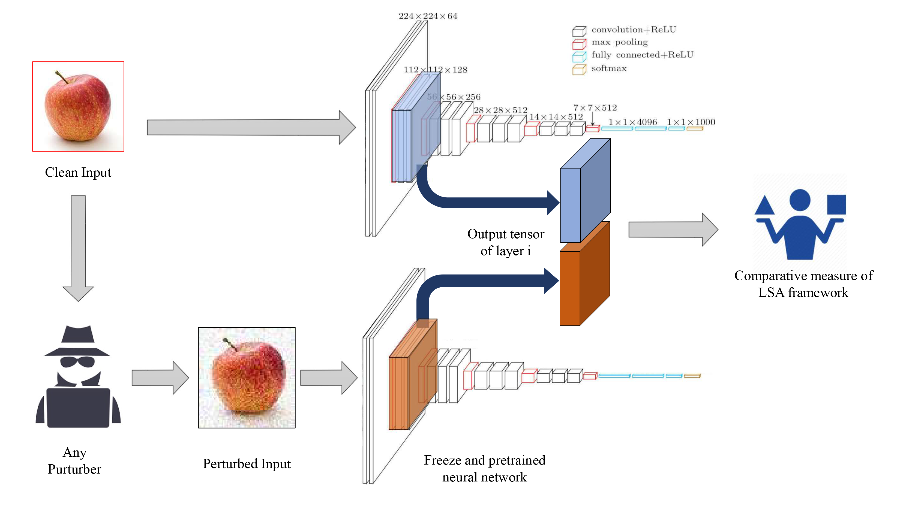

# Layers Sustainability Analysis framework (LSA)

LSA stands for Layer Sustainability Analysis for the analysis of layer vulnerability in a given neural network. LSA can be a helpful toolkit to assess deep neural networks and to extend the adversarial training approaches towards improving the sustainability of model layers via layer monitoring and analysis. The LSA framework identifies a list of Most Vulnerable Layers (MVL list) of a given network. The relative error, as a comparison measure, is used to evaluate representation sustainability of each layer against adversarial attack inputs. 

## overview
The proposed approach for obtaining robust neural networks to fend off adversarial attacks is based on a layer-wise regularization (LR) over LSA proposal(s) for adversarial training (AT); i.e. the AT-LR procedure. AT-LR could be used with any benchmark adversarial attack to reduce the vulnerability of network layers and to improve conventional adversarial training approaches. The proposed idea performs well theoretically and experimentally for state-of-the-art multilayer perceptron and convolutional neural network architectures.

## Getting Started
To be completed ...