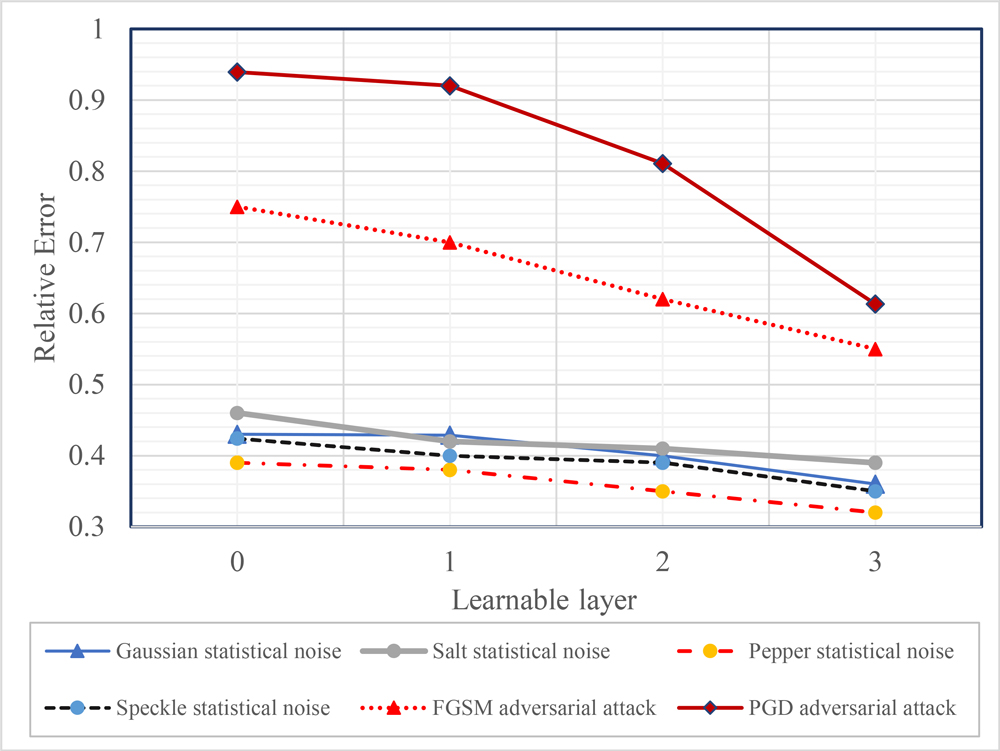
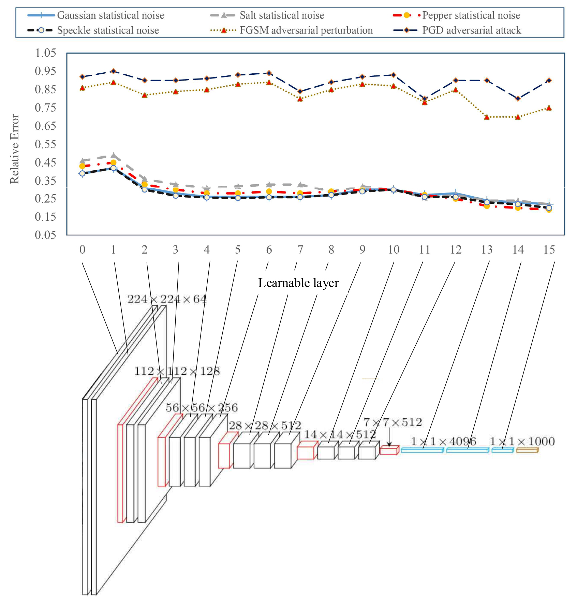

# Layers Sustainability Analysis framework (LSA)
[[Presentation]](#)  [[Pytorch code]](https://github.com/khalooei/LSA) [[Paper]](https://arxiv.org/abs/2202.02626)


LSA stands for Layer Sustainability Analysis for the analysis of layer vulnerability in a given neural network. LSA can be a helpful toolkit to assess deep neural networks and to extend the adversarial training approaches towards improving the sustainability of model layers via layer monitoring and analysis. The LSA framework identifies a list of Most Vulnerable Layers (MVL list) of a given network. The relative error, as a comparison measure, is used to evaluate representation sustainability of each layer against adversarial attack inputs. 

[](https://github.com/khalooei/LSA/blob/master/LICENSE)
[](https://pypi.org/project/layer-sustainability-analysis/)
[](#)
[](https://github.com/khalooei/LSA/releases)

## Overview
Sustainability and vulnerability in different domains have many definitions. In our case, the focus is on certain vulnerabilities that fool deep learning models in the feed-forward propagation approach. One main concentration is therefore on the analysis of forwarding vulnerability effects of deep neural networks in the adversarial domain. Analyzing the vulnerabilities of deep neural networks helps better understand different behaviors in dealing with input perturbations in order to attain more robust and sustainable models.


Analyzing the vulnerabilities of deep neural networks helps better understand different behaviors in dealing with input perturbations in order to attain more robust and sustainable models. One of the fundamental mathematical concepts that comes to mind in the sustainability analysis approach is Lipchitz continuity which grants deeper insight into the sustainability analysis of neural network models by approaching LR from the Lipschitz continuity perspective. 


## Table of Contents
1. [Requirements and Installation](#Requirements-and-Installation)
2. [Getting Started](#Getting-Started)
3. [Usage](#usage)
4. [Citation](#Citation)
5. [Contribution](#Contribution)


## Requirements and Installation

### :clipboard: Requirements

- PyTorch version >=1.6.0
- Python version >=3.6


### :hammer: Installation

```
pip install layer-sustainability-analysis
```


## Getting Started

###  :warning: Precautions
* The LSA framework could be applied to any neural network architecture with no limitations.
* * **`random_seed = 313`** to get same training procedures. Some operations are non-deterministic with float tensors on GPU  [[discuss]](https://discuss.pytorch.org/t/inconsistent-gradient-values-for-the-same-input/26179).
* Also, **`torch.backends.cudnn.deterministic = True` to get same adversarial examples with fixed random seed**. 
* LSA uses a **hook** to represent each layer of the neural network. Thus, you can change its probs (checker positions). Activation functions such as *ReLU* and *ELU* are default probs.


### :rocket: Demos

#### Given `selected_clean_sample`, `selected_pertubed_sample` and comparison `measure` are used in LSA:

```python
from layer-sustainability-analysis import LayerSustainabilityAnalysis as LSA
lsa = LSA(pretrained_model=model)
lst_comparison_measures = LSA.representation_comparison(img_clean=selected_clean_sample, img_perturbed=selected_pertubed_sample, measure ='relative-error')
```


## Usage
###  :white_check_mark: Neural network behavior analysis through feed-forward monitoring approach
The figure illustrates comparison measure values for representation tensors of layers, during which a trained model is fed both clean and corresponding adversarially or statistically perturbed samples. Fluctuation patterns of comparison measure values for each layer in the model also demonstrate the difference in layer behaviors for clean and corresponding perturbed input. As can be seen in different model architectures, adversarial perturbations are more potent and have higher comparison measure values than statistical ones. In fact, as the literature shows that adversarial attacks are near the worst-case perturbations. However, the relative error of PGD-based adversarial attacks is much higher than that of FGSM adversarial attacks in all experiments. Salt and Gaussian statistical perturbation (noise) also have a much higher relative error value than the other statistical perturbations.  

Note that some layers are more vulnerable than others.
In other words, some layers are able to sustain disruptions and focus on vital features, while others are not. 
Each layer in below figure is related to any of learnable convolutional or fully connected layers. 


[To be completed ...]


One of the incentives of introducing regularization terms in the loss function of deep neural networks is to restrict certain effective parameters. 
Researchers have attempted to discover effective parameters in several ways, but most approaches are not applicable to all networks. 
A new approach to perform an effective sensitivity analysis of different middle layers of a neural network and administer the vulnerability in the loss function is obtained from the layer sustainability analysis framework. 
The loss function of the network can be improved by including such regularization terms to reduce the vulnerability of middle layers.

<center>

</center>

As observed in above equations, the proposed LR term is added in order to define an extension on base adversarial training through an inner maximization and outer minimization optimization problem. 

<center>

</center>


[To be completed ...]


## Citation
If you use this package, please cite the following BibTex ([SemanticScholar](https://www.semanticscholar.org/paper/Layer-wise-Regularized-Adversarial-Training-using-Khalooei-Homayounpour/d81464534f26bc5f9b5122e9fd1390bb1e07f575), [GoogleScholar](https://scholar.google.com/citations?view_op=view_citation&hl=en&user=2HFVUn4AAAAJ&citation_for_view=2HFVUn4AAAAJ:Y0pCki6q_DkC)):

```
@article{Khalooei2022LayerwiseRA,
  title={Layer-wise Regularized Adversarial Training using Layers Sustainability Analysis (LSA) framework},
  author={Mohammad Khalooei and Mohammad Mehdi Homayounpour and Maryam Amirmazlaghani},
  journal={ArXiv},
  year={2022},
  volume={abs/2202.02626}
}
```


## Contribution

All kind of contributions are always welcome! 

Please let me know if you are interested in adding a new comparison measure or feature map visualization to this repository or if you would like to fix some issues.

